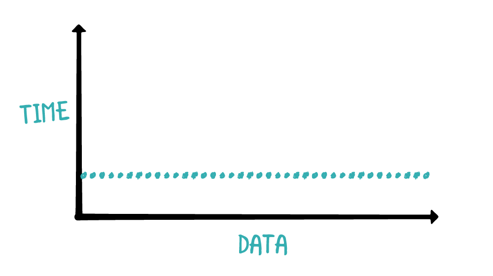
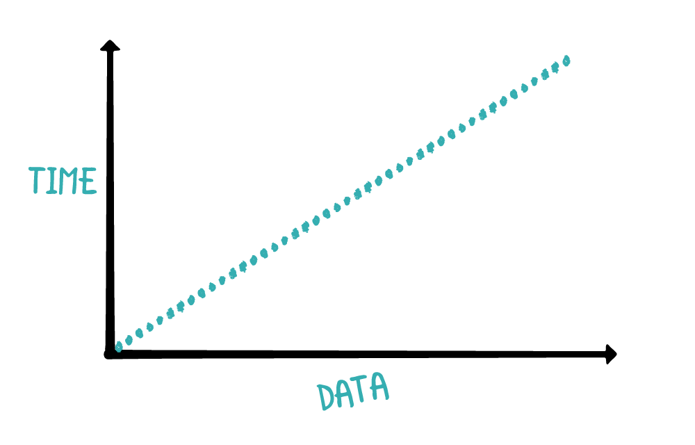
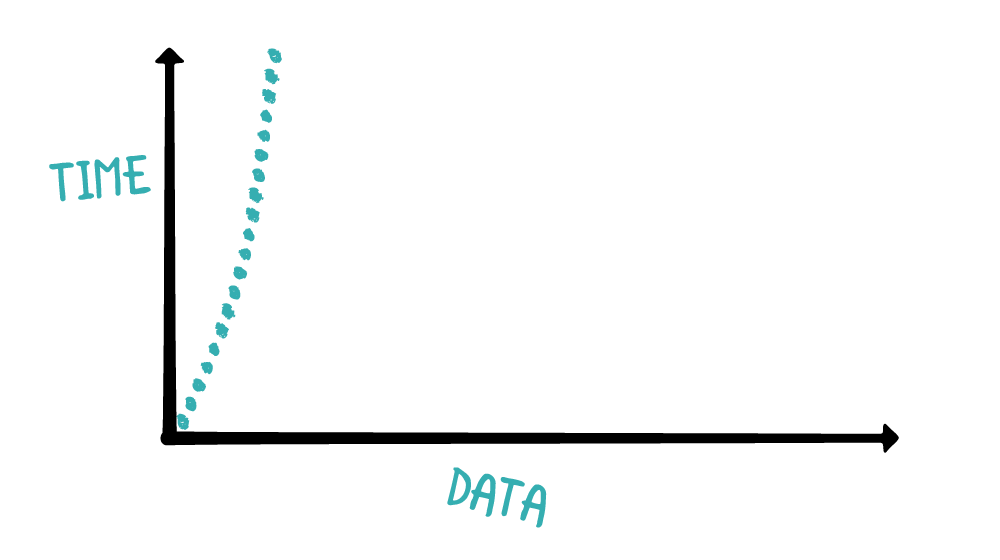
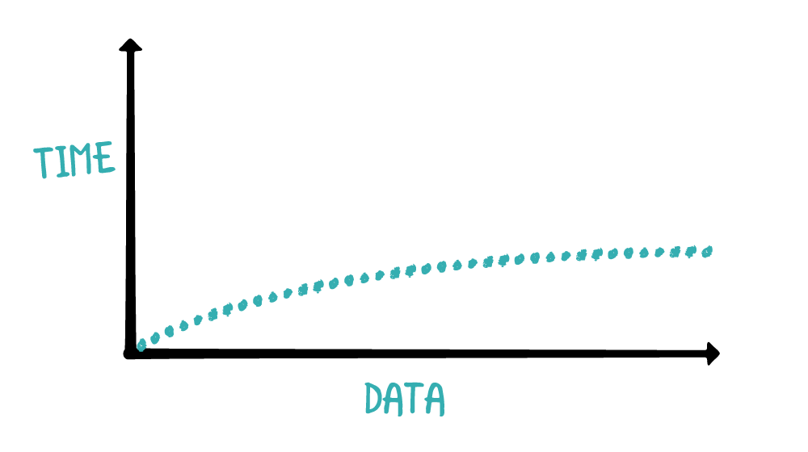
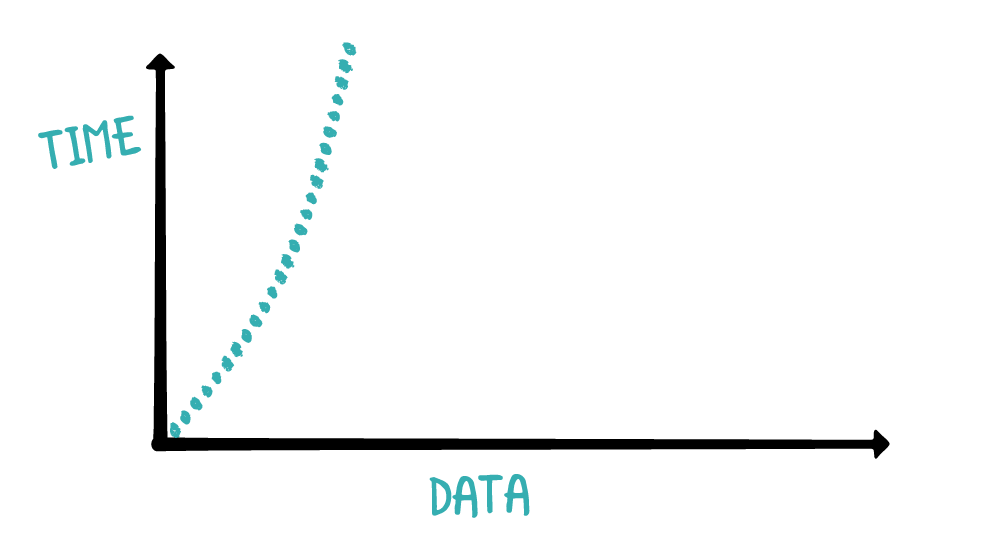

# Complexity
* [Time Complexity](#time-complexity)
    * [Constant time](#Constant-time)
    * [Linear time](#Linear-time)
    * [Quadratic](#Quadratic)
    * [Logarithmic time](#Logarithmic-time)
    * [Quasilinear time](#Quasilinear-time)
    * [other](#other-time-complexities)
* [Space complexity](#Space-complexity)

---

## Time complexity [[Top]](#Complexity)
For small amounts of data, even the most expensive algorithm can seem fast due to the speed of modern hardware. However, as data increases, cost of an expensive algorithm becomes increasingly apparent. Time complexity is a measure of the time required to run an algorithm as the input size increases. In this section, you'll go through the most common time complexities and learn how to identify them.

---

### Constant time [[Top]](#Complexity)
A constant time algorithm is one that has the same running time regardless of the size of the input. Consider the following:

```swift
func checkFirst(names: [String]) {
  if let first = names.first {
    print(first)
  } else {
    print("no names")
  }
}
```

The size of the names array has no effect on the running time of this function. Whether the input has 10 items or 10 million items, this function only checks the first element of the array. Here's a visualization of this time complexity in a plot between time versus data size:

 

As input data increases, the amount of time the algorithm takes does not change.
For brevity, programmers use a notation known as Big O notation to represent various magnitudes of time complexity. The Big O notation for constant time is O(1).

---

### Linear Time [[Top]](#Complexity)
Consider the following snippet of code: 

```swift
func printNames(names: [String]) {
  for name in names {
    print(name)
  }
}
```

This function prints out all the names in a String array. As the input array increases in size, the number of iterations that the for loop makes is increased by the same amount.
This behavior is known as linear time complexity:



Linear time complexity is usually the easiest to understand. As the amount of data increases, the running time increases by the same amount. That's why you have the straight linear graph illustrated above. The Big O notation for linear time is O(n) 


What about a function that has two loops over all the data and a calls six O(1) methods? Is it O(2n + 6) ?
Time complexity only gives a high-level shape of the performance, so loops that happen a set number of times are not part of the calculation. All constants are dropped in the final Big O notation. In other words, O(2n + 6) is surprisingly equal to O(n).
Although not a central concern of this book, optimizing for absolute efficiency can be important. Companies put millions of dollars of R&D into reducing the slope of those constants that Big O notation ignores. For example, a GPU optimized version of an algorithm might run 100x faster than the naive CPU version while still remaining O(n). Although we will ignore this kind of optimization, speedups like this matter.


---

### Quadratic time[[Top]](#Complexity)
More commonly referred to as n squared, this time complexity refers to an algorithm that takes time proportional to the square of the input size. Consider the following code:

```swift
func printNames(names: [String]) {
  for _ in names {
    for name in names {
      print(name)
    }
  }
}
```

This time, the function prints out all the names in the array for every name in the array. If you have an array with 10 pieces of data, it will print the full list of 10 names 10 times. That's 100 print statements.
If you increase the input size by one, it will print the full list of 11 names 11 times, resulting in 121 print statements. Unlike the previous function, which operates in linear time, the n squared algorithm can quickly run out of control as the data size increases.
Here's a graph illustrating this behavior:

 

As the size of the input data increases, the amount of time it takes for the algorithm to run increases drastically. Thus, n squared algorithms don't perform well at scale.

The Big O notation for quadratic time is O(n^2).

No matter how inefficiently a linear time _O(n) is written (multiple passes etc), for a sufficiently large n, the linear time algorithm will execute faster than a super optimized quadratic algorithm. Always. Every time.

---

### Logarithmic time [[Top]](#Complexity)

So far, you've learned about the linear and quadratic time complexities wherein each element of the input is inspected at least once. However, there are scenarios in which only a subset of the input needs to be inspected, leading to a faster runtime.
Algorithms that belong to this category of time complexity are ones that can leverage some shortcuts by making some assumptions about the input data. For instance, if you had a sorted array of integers, what is the quickest way to find if a particular value exists?
A naive solution would be to inspect the array from start to finish to check every element before reaching a conclusion. Since you're inspecting each of the elements once, that would be a O(n) algorithm. Linear time is fairly good, but you can do better. Since the input array is sorted, there is an optimization that you can make. Consider the following code:

```swift
let numbers = [1, 3, 56, 66, 68, 80, 99, 105, 450]

func naiveContains(_ value: Int, in array: [Int]) -> Bool {
  for element in array {
    if element == value {
      return true
    }
  }
  
  return false
}
```

If you were checking if the number 451 existed in the array, the naive algorithm would have to iterate from the beginning to end, making a total of nine inspections for the nine values in the array. However, since the array is sorted, you can, right off the bat, drop half of the comparisons necessary by checking the middle value: 

```swift
func naiveContains(_ value: Int, in array: [Int]) -> Bool {
  guard !array.isEmpty else { return false }
  let middleIndex = array.count / 2

  if value <= array[middleIndex] {
    for index in 0...middleIndex {
      if array[index] == value {
        return true
      } 
    }
  } else {
    for index in middleIndex..<array.count {
      if array[index] == value {
        return true
      } 
    }
  }
  return false
} 
```

The above function makes a small but meaningful optimization wherein it only checks half of the array to come up with a conclusion.
The algorithm first checks the middle value to see how it compares with the desired value. If the middle value is bigger than the desired value, the algorithm won't bother looking at the values on the right half of the array; since the array is sorted, values to the right of the middle value can only get bigger.
In the other case, if the middle value is smaller than the desired value, the algorithm won't look at the left side of the array. This is a small but meaningful optimization that cuts the number of comparisons by half. What if you could do this optimization repeatedly throughout this method? You'll find out in Chapter 20, "Binary Search."
An algorithm that can repeatedly drop half of the required comparisons will have logarithmic time complexity. Here's a graph depicting how a logarithmic time algorithm would behave as input data increases:



As input data increases, the time it takes to execute the algorithm increases at a slow rate. If you look closely, you may notice that the graph seems to exhibit asymptotic behavior. This can be explained by considering the impact of halving the amount of comparisons you need to do.
When you have an input size of 100, halving the comparisons means you save 50 comparisons. If input size was 100,000, halving the the comparisons means you save 50,000 comparisons. The more data you have, the more the halving effect scales. Thus, you can see that the graph appears to approach horizontal.
Algorithms in this category are few, but extremely powerful in situations that allow for it. The Big O notation for logarithmic time complexity is O(log n).

`Is it log base 2, log base 10, or the natural log?
In the above example, log base 2 applies. However, since Big O notation only concerns itself with the shape of the performance the actual base doesn't matter.`


---

### Quasilinear time [[Top]](#Complexity)

Another common time complexity you'll encounter is quasilinear time. Quasilinear time algorithms perform worse than linear time but dramatically better than quadratic time. They are among the most common algorithms you'll deal with. An example of a quasilinear time algorithm is Swift's sort method.
The Big-O notation for quasilinear time complexity is O(n log n) which is a multiplication of linear and logarithmic time. So quasilinear fits doesn't fit between logarithmic and linear time; it is a magnitude worse than linear time, but still better than many of the other complexities that you'll see next. Here's the graph:



The quasilinear time complexity shares a similar curve with quadratic time, but is more resilient to large data sets.

---

### Other time complexities [[Top]](#Complexity)

The five time complexities you've encountered so far are the ones that you'll encounter in this book. Other time complexities do exist, but are far less common and tackle more complex problems that are not discussed in this book. These time complexities include polynomial time, exponential time, factorial time and more.
It is important to note that time complexity is a high-level overview of performance, and it doesn't judge the speed of the algorithm beyond the general ranking scheme. This means that two algorithms can have the same time complexity, but one may still be much faster than the other. For small data sets, time complexity may not be an accurate measure of actual speed.
For instance, quadratic algorithms such as insertion sort can be faster than quasilinear algorithms, such as mergesort, if the data set is small. This is because insertion sort does not need to allocate extra memory to perform the algorithm, while mergesort needs to allocate multiple arrays. For small data sets, the memory allocation can be expensive relative to the number of elements the algorithm needs to touch.

---

### Comparing time complexity [[Top]](#Complexity)
Suppose you wrote the following code that finds the sum of numbers from 1 to n.

```swift
func sumFromOne(upto n: Int) -> Int {
  var result = 0
  for i in 1...n {
    result += i
  }
  return result
}
  
sumFromOne(upto: 10000)
```

The code loops 10000 times and returns 50005000. It is O(n) and will take a moment to run in a playground as it counts through the loop and prints results.

You can write another version:

```swift
func sumFromOne(upto n: Int) -> Int {
  return (1...n).reduce(0, +)
}
sumFromOne(upto: 10000)
```

In a playground this will run faster because it calls compiled code in standard library. However, if you look up the time complexity for reduce, you'll discover that it is also O(n) as it calls the + method n times. It is the same Big O, but has smaller constants because it is compiled code.
Finally, you can write:

```swift
func sumFromOne(upto n: Int) -> Int {
  return (n + 1) * n / 2
}
sumFromOne(upto: 10000)
```

This version of the function uses a trick that the Fredrick Gauss noticed in elementary school. Namely, you can compute the sum using simple arithmetic. This final version of the algorithm is O(1) and tough to beat. A constant time algorithm is always preferred. If you put this version in a loop you still end up with linear time. The previous O(n) versions are just one outer loop away from slow, quadratic time.

---

## Space complexity [[Top]](#Complexity)

The time complexity of an algorithm can help predict scalability, but it isn't the only metric. Space complexity is a measure of the resources required for the algorithm to run. For computers, the resources for algorithms is memory. Consider the following code:

```swift
func printSorted(_ array: [Int]) {
  let sorted = array.sorted()
  for element in sorted {
    print(element)
  }
}
```

The above function will create a sorted copy of the array and print the array. To calculate the space complexity, you analyze the memory allocations for the function.
Since array.sorted() will produce a brand new array with the same size of array, the space complexity of printSorted is O(n). While this function is simple and elegant, there may be some situations in which you want to allocate as little memory as possible. You could revise the above function to the following:

```swift
func printSorted(_ array: [Int]) {
  // 1 
  guard !array.isEmpty else { return }

  // 2
  var currentCount = 0
  var minValue = Int.min

  // 3
  for value in array {
    if value == minValue {
      print(value)
      currentCount += 1
    }
  }

  while currentCount < array.count {
  
    // 4
    var currentValue = array.max()!
    
    for value in array {
      if value < currentValue && value > minValue {
        currentValue = value
      }
    }

    // 5
    var printCount = 0
    for value in array {
      if value == currentValue {
        print(value)
        currentCount += 1
      }
    }

    // 6
    minValue = currentValue
  }
}
```

This implementation respects space constraints. The overall goal is to iterate through the array multiple times, printing the next smallest value for each iteration.
Here's what this algorithm is doing:


`1. Check for the case if the array is empty. If it is, there's nothing to print.`
`2. currentCount keeps track of the number of print statements made . minValue stores the last printed value.`
`3. The algorithm begins by printing out all values matching the minValue, and updates the currentCount according to the number of print statements made.`
`4. Using the while loop, the algorithm finds the lowest value bigger than minValue and stores it in currentValue.`
`5. The algorithm then prints all values of currentValue inside the array while updating currentCount.`
`6. minValue is set to currentValue so the next iteration will try to find the next minimum value.`


The above algorithm only allocates memory to keep track of a few variables, so the space complexity is O(1). This is in contrast with the previous function, which allocates an entire array to create the sorted representation of the source array. 

#### Key points

`Time complexity` is a measure on the time required to run an algorithm as the input size increases.

`Space complexity` is a measure of the resources required for the algorithm to run.

`Big O notation` is used to represent the general form of time and space complexity.

`Time and space complexity are high-level measures of scalability; they do not measure the actual speed of the algorithm itself.`

`For small data sets, time complexity is usually irrelevant. A quasilinear algorithm can be slower than a linear algorithm. `

