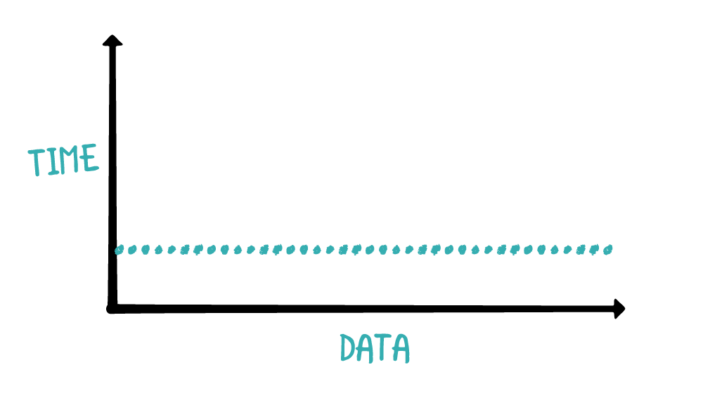
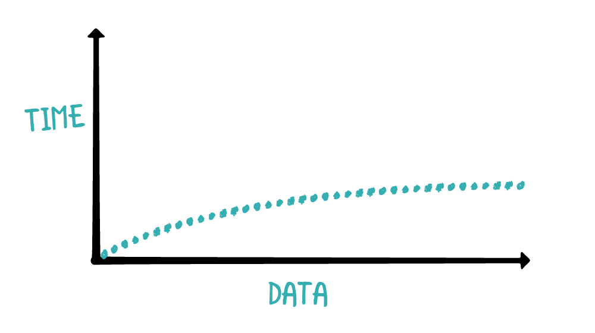
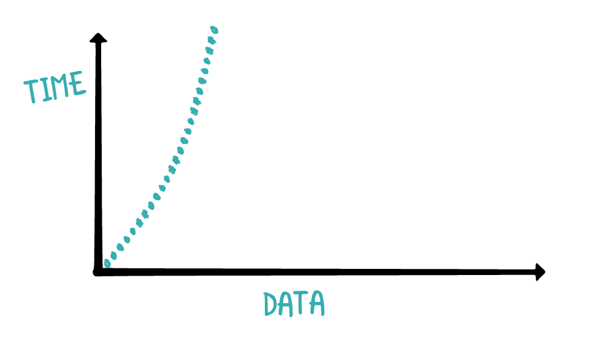

#Complexity

`Time complexity` is a measure on the time required to run an algorithm as the input size increases.

`Space complexity` is a measure of the resources required for the algorithm to run.

`Big O notation` is used to represent the general form of time and space complexity.

`Time and space complexity are high-level measures of scalability; they do not measure the actual speed of the algorithm itself.`

`For small data sets, time complexity is usually irrelevant. A quasilinear algorithm can be slower than a linear algorithm. `

## Time Complexity

|NO.|Time Complexity|Big O notation|Graph|
|---|---|---|---|
|1|Consant time|O(1)| |
|2|Linear time|O(n)| |
|3|Quadratic time|O(n^2)| |
|4|Logarithmic time|O(log n)| |
|5|Quasilinear time|O(n log n)| |

### Constant time O(1) example code:
```swift
func checkFirst(names: [String]) {
  if let first = names.first {
    print(first)
  } else {
    print("no names")
  }
}
```

### Linear time O(n) example code:
```swift
func printNames(names: [String]) {
  for name in names {
    print(name)
  }
}
```

### Quadratic time O(n^2) example code:
```swift
func printNames(names: [String]) {
  for _ in names {
    for name in names {
      print(name)
    }
  }
}
```

### Logarithmic time O(log n) example code:
```swift
let numbers = [1, 3, 56, 66, 68, 80, 99, 105, 450]

func naiveContains(_ value: Int, in array: [Int]) -> Bool {
  for element in array {
    if element == value {
      return true
    }
  }
  
  return false
}
```

### Quasilinear time O(n log n) example code: none

--- 

## Space Conplexity

```swift
func printSorted(_ array: [Int]) {
  let sorted = array.sorted()
  for element in sorted {
    print(element)
  }
}
```

The above function will create a sorted copy of the array and print the array. To calculate the space complexity, you analyze the memory allocations for the function.
Since array.sorted() will produce a brand new array with the same size of array, the space complexity of printSorted is O(n). While this function is simple and elegant, there may be some situations in which you want to allocate as little memory as possible. You could revise the above function to the following:

```swift
func printSorted(_ array: [Int]) {
  // 1. Check for the case if the array is empty. If it is, there's nothing to print.
  guard !array.isEmpty else { return }

  // 2. currentCount keeps track of the number of print statements made . minValue stores the last printed value.
  var currentCount = 0
  var minValue = Int.min

  // 3. The algorithm begins by printing out all values matching the minValue, and updates the currentCount according to the number of print statements made.
  for value in array {
    if value == minValue {
      print(value)
      currentCount += 1
    }
  }

  while currentCount < array.count {
  
    // 4. Using the while loop, the algorithm finds the lowest value bigger than minValue and stores it in currentValue.
    var currentValue = array.max()!
    
    for value in array {
      if value < currentValue && value > minValue {
        currentValue = value
      }
    }

    // 5. The algorithm then prints all values of currentValue inside the array while updating currentCount.
    var printCount = 0
    for value in array {
      if value == currentValue {
        print(value)
        currentCount += 1
      }
    }

    // 6. minValue is set to currentValue so the next iteration will try to find the next minimum value.
    minValue = currentValue
  }
}
```


