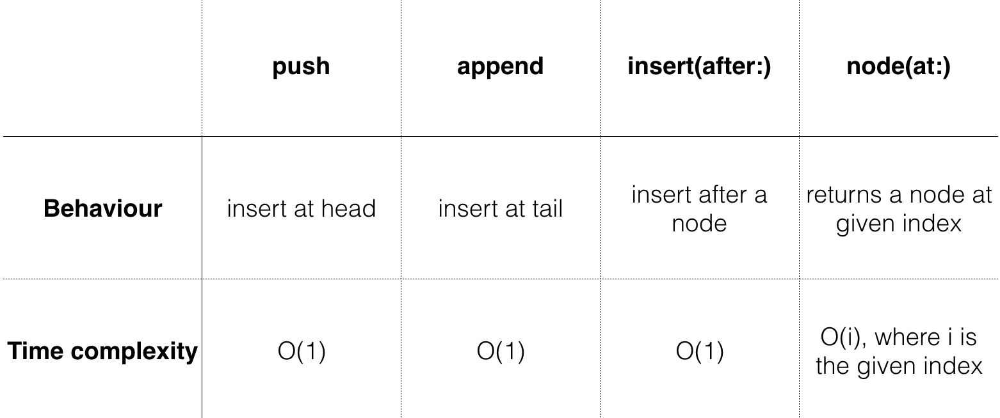

# Linked List
1. Node

A linked list is a collection of values arranged in a linear unidirectional sequence. A linked list has several theoretical advantages over contiguous storage options such as the Swift Array:

*Constant time insertion and removal from the front of the list.  
*Reliable performance characteristics.


As the diagram suggests, a linked list is a chain of nodes. Nodes have two responsibilities:

1. Hold a value.

2. Hold a reference to the next node. A nil value represents the end of the list.


In this chapter, you'll implement a linked list and learn about the common operations associated with it. You'll learn about the time complexity of each operation, and you'll implement a neat little Swift feature known as copy-on-write.
Open up the starter playground for this chapter so that you can dive right into the code.

---

## Node
Create a new Swift file in the Sources directory and name it Node.swift. Add the following to the file:

```swift
public class Node<Value> {

  public var value: Value
  public var next: Node?
  
  public init(value: Value, next: Node? = nil) {
    self.value = value
    self.next = next
  }
}

extension Node: CustomStringConvertible {

  public var description: String {
    guard let next = next else {
      return "\(value)"
    }
    return "\(value) -> " + String(describing: next) + " "
  }
}
```

Navigate to the playground page and add the following:

```swift
example(of: "creating and linking nodes") {
  let node1 = Node(value: 1)
  let node2 = Node(value: 2)
  let node3 = Node(value: 3)
  
  node1.next = node2
  node2.next = node3
  
  print(node1)
}
```

You’ve just created three nodes and connected them:


In the console, you should see the following output:

```
---Example of creating and linking nodes---
1 -> 2 -> 3
```

As far as practicality goes, the current method of building lists leaves a lot to be desired. You can easily see that building long lists this way is impractical. A common way to alleviate this problem is to build a LinkedList that manages the Node objects. You’ll do just that!
LinkedList
In the Sources directory, create a new file and name it LinkedList.swift. Add the following to the file:

```swift
public struct LinkedList<Value> {

  public var head: Node<Value>?
  public var tail: Node<Value>?
  
  public init() {}

  public var isEmpty: Bool {
    return head == nil
  }
}

extension LinkedList: CustomStringConvertible {

  public var description: String {
    guard let head = head else {
      return "Empty list"
    }
    return String(describing: head)
  }
}
```

A linked list has the concept of a head and tail, which refers to the first and last nodes of the list respectively:


---

## Adding values to the list

As mentioned before, you’re going to provide an interface to manage the Node objects. You’ll first take care of adding values. There are three ways to add values to a linked list, each having their own unique performance characteristics:

1. push: Adds a value at the front of the list.

2. append: Adds a value at the end of the list.

3. insert(after:): Adds a value after a particular node of the list.

You’ll implement each of these in the next section and analyze their performance characteristics.

### push operations

Adding a value at the front of the list is known as a push operation. This is also known as head-first insertion. The code for it is deliciously simple.
Add the following method to LinkedList:

```swift
public mutating func push(_ value: Value) {
  head = Node(value: value, next: head)
  if tail == nil {
    tail = head
  }
}
```

In the case in which you’re pushing into an empty list, the new node is both the head and tail of the list.

In the playground page, add the following:

```swift
example(of: "push") {
  var list = LinkedList<Int>()
  list.push(3)
  list.push(2)
  list.push(1)
  
  print(list)
}
```

Your console output should show this:

```
---Example of push---
1 -> 2 -> 3
```

### append operations

The next operation you’ll look at is append. This is meant to add a value at the end of the list, and it is known as tail-end insertion.
In LinkedList.swift, add the following code just below push:

```swift
public mutating func append(_ value: Value) {

  // 1
  guard !isEmpty else {
    push(value)
    return
  }
  
  // 2
  tail!.next = Node(value: value)
  
  // 3
  tail = tail!.next
}
```

This code is relatively straightforward:
Like before, if the list is empty, you’ll need to update both head and tail to the new node. Since append on an empty list is functionally identical to push, you simply invoke push to do the work for you.
In all other cases, you simply create a new node after the tail node. Force unwrapping is guaranteed to succeed since you push in the isEmpty case with the above guard statement.
Since this is tail-end insertion, your new node is also the tail of the list.
Leap back into the playground and write the following at the bottom:

```swift
example(of: "append") {
  var list = LinkedList<Int>()
  list.append(1)
  list.append(2)
  list.append(3)
  
  print(list)
}
```

You should see the following output in the console:

```
---Example of append---
1 -> 2 -> 3
```

---

### insert(after:) operations
The third and final operation for adding values is insert(after:). This operation inserts a value at a particular place in the list, and requires two steps:

1. Finding a particular node in the list.
2. Inserting the new node.

First, you’ll implement the code to find the node where you want to insert your value.

In LinkedList.swift, add the following code just below append:

```swift
public func node(at index: Int) -> Node<Value>? {
  // 1
  var currentNode = head
  var currentIndex = 0
  
  // 2
  while currentNode != nil && currentIndex < index {
    currentNode = currentNode!.next
    currentIndex += 1
  }
  
  return currentNode
}
```

node(at:) will try to retrieve a node in the list based on the given index. Since you can only access the nodes of the list from the head node, you’ll have to make iterative traversals. Here’s the play-by-play:

1. You create a new reference to head and keep track of the current number of traversals.

2. Using a while loop, you move the reference down the list until you’ve reached the desired index. Empty lists or out-of-bounds indexes will result in a nil return value.

Now you need to insert the new node.

Add the following method just below node(at:):

```swift
// 1
@discardableResult
public mutating func insert(_ value: Value,
                            after node: Node<Value>)
                            -> Node<Value> {
  // 2
  guard tail !== node else {
    append(value)
    return tail!
  }
  // 3
  node.next = Node(value: value, next: node.next)
  return node.next!
}
```

Here’s what you’ve done:

1. @discardableResult lets callers ignore the return value of this method without the compiler jumping up and down warning you about it.

2. In the case where this method is called with the tail node, you’ll call the functionally equivalent append method. This will take care of updating tail.

3. Otherwise, you simply link up the new node with the rest of the list and return the new node.

Hop back to the playground page to test this out. Add the following to the bottom of the playground:

```swift
example(of: "inserting at a particular index") {
  var list = LinkedList<Int>()
  list.push(3)
  list.push(2)
  list.push(1)
  
  print("Before inserting: \(list)")
  var middleNode = list.node(at: 1)!
  for _ in 1...4 {
    middleNode = list.insert(-1, after: middleNode)
  }
  print("After inserting: \(list)")
}
```

You should see the following output:”

```
---Example of inserting at a particular index---
Before inserting: 1 -> 2 -> 3
After inserting: 1 -> 2 -> -1 -> -1 -> -1 -> -1 -> 3
```
---

### Performance analysis
Whew! You’ve made good progress so far. To recap, you’ve implemented the three operations that add values to a linked list and a method to find a node at a particular index.



Next, you’ll focus on the opposite action: removal operations.

---

## Removing values from the list

There are three main operations for removing nodes:

1. pop: Removes the value at the front of the list.

2. removeLast: Removes the value at the end of the list.
3. remove(at:): Removes a value anywhere in the list.

You’ll implement all three and analyze their performance characteristics.

---

### pop operations
Removing a value at the front of the list is often referred to as pop. This operation is almost as simple as push, so dive right in.

Add the following method to LinkedList:”


