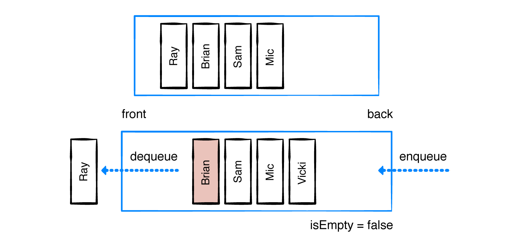
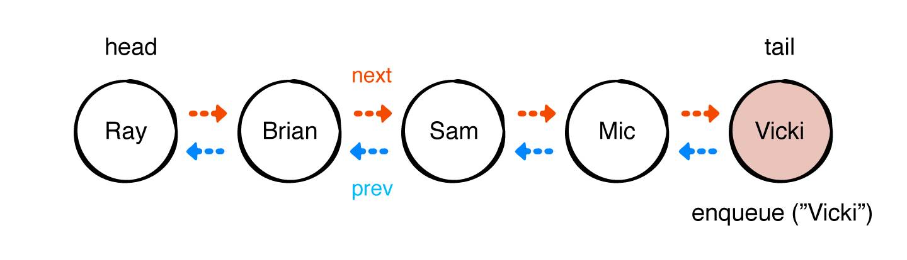

# Queue

The easiest way to understand how a queue works is to see a working example. Imagine a group of people waiting in line for a movie ticket.



The queue currently holds Ray, Brian, Sam and Mic. Once Ray has received his ticket, he moves out of the line. By calling dequeue(), Ray is removed from the front of the queue.
Calling peek will return Brian since he is now at the front of the line.
Now comes Vicki, who just joined the line to buy a ticket. By calling enqueue("Vicki"),
Vicki gets added to the back of the queue.
In the following sections, you will learn to create a queue in four different ways:

* Using an array
* Using a doubly linked list
* Using a ring buffer
* Using two stacks

## Array-based implementation

```swift
public struct QueueArray<T>: Queue {
  private var array: [T] = []
  public init() {}
}
```

### Leveragin arrays

```swift
public var isEmpty: Bool {
  return array.isEmpty // 1
}
public var peek: T? {
  return array.first // 2
}
```

### Enqueue

```swift
public mutating func enqueue(_ element: T) -> Bool {
  array.append(element)
return true
}
```

### Dequeue

```swift
public mutating func dequeue() -> T? {
  return isEmpty ? nil : array.removeFirst()
}
```

### Debug and test

```swift
extension QueueArray: CustomStringConvertible {
  public var description: String {
    return String(describing: array)
  }
}
```

```swift
var queue = QueueArray<String>()
queue.enqueue("Ray")
queue.enqueue("Brian")
queue.enqueue("Eric")
queue
queue.dequeue()
queue
queue.peek
```


## Doubly linked list implementation


```swift
public class QueueLinkedList<T>: Queue {
  private var list = DoublyLinkedList<T>()
  public init() {}
}
```

### Enqueue

```swift
public func enqueue(_ element: T) -> Bool {
  list.append(element)
return true
}
```

### Dequeue



```swift
public func dequeue() -> T? {
  guard !list.isEmpty, let element = list.first else {
return nil
}
  return list.remove(element)
}
```

### Checking the state of a queue

```swift
public var peek: T? {
  return list.first?.value
}
public var isEmpty: Bool {
  return list.isEmpty
}
```

### Debug and test
```
extension QueueLinkedList: CustomStringConvertible {
  public var description: String {
    return String(describing: list)
  }
}
```
```
var queue = QueueLinkedList<String>()
queue.enqueue("Ray")
queue.enqueue("Brian")
queue.enqueue("Eric")
queue
queue.dequeue()
queue
queue.peek
```

## Ring buffer implementation
```swift

```
```swift
```
```swift
```
```swift
```
```swift
```
```swift
```


